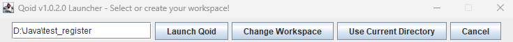
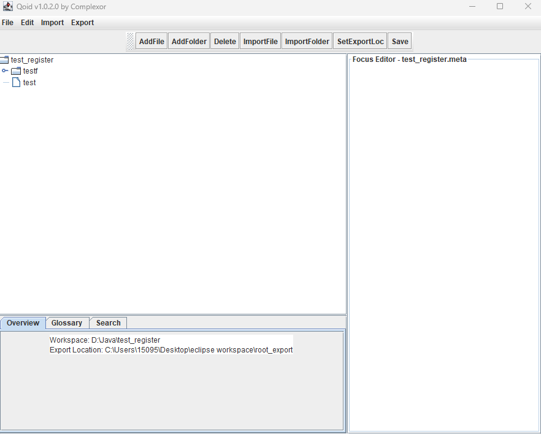

# Qoid.java

This repository contains the robustly-typed version of the Qoid markup language, along with a simple IDE for creating and modifying Qoid files, which use the extension `.cxr`.

Please note that this project was recovered from a JAR file and decompiled, and thus the code has some eccentricities which are yet to be ironed out.

## Overview

This application was developed to assist in the creation and management of Qoid **registers**, which are folders containing Qoid files, called **bills**. The IDE also has comment and variable support as described below.

## Objects

A **property** is a tag-value pair. While the canonical tag-value pair has tags and values which are strings, there is general support for arbitrary comparable objects.

```
tag: value
```

A **qoid** is a tagged collection of properties. The type of the tag can vary, and the type of the property can be as generic as you like if you have multiple types of properties.

```
#test
tag: value
tag: value2
```

A **bill** is a collection of qoids, and is the fundamental object which is saved to a file.

A **register** is a qoid folder, which is a collection of both bills and registers. Registers contain `.meta` files which are used to declare variables and store additional information, usually about the register itself.

## Additional syntax

Qoid supports comments, which begin with a forward slash (`/`).

```
#test
tag: value
/ This is a comment. It will not appear when exporting to CXR.
tag2: value2
```

## The IDE

When launched, the first thing you will see is the launcher.



Use the launcher to set the path for your register, then click "Launch Qoid". Once you have launched your first project register, the launcher will remember the path.



On the left we have the file tree, which you can navigate through to select registers to add files and folders, or individual bills to edit.

The editor appears on the right. If a register is selected, then the register's meta file will be opened in the editor. Otherwise the contents of the selected bill will be displayed. Whenever you change selection, the file you've edited will be tracked but won't save until you select `File -> Save`.

Below the file tree are the meta tabs.

* The overview provides some basic information about the project.
* The glossary shows the entire project's file tree in a simplified view
* The search tab allows you to enter a search term and see where in the project the term appears. It does so by specifying which file and line containing the term.

The buttons along the top do what you'd think they do - add files and folders, delete existing ones, and import files and folders from other Qoid projects. Finally, you can set the default export location, which the IDE will remember.

The menu along the top provides an alternate way to access some functions, as well as the Export function. Exports come in three flavors:

* Raw project: Every folder, file, and its contents (regardless of adherence to Qoid syntax) is saved to the selected location.
* CXR: The project's variables are broadcasted, and only valid Qoid syntax is compiled. This means that `.meta` files and comments are scrubbed from the export.
* JSCON: Qoid syntax is converted to a JSON format which preserves the ability to use duplicate tags for qoid objects within a bill.

## Variable support

In a register's meta file, you can define a variable using the following syntax:

```
@variable_name: variable value
```

Variables can be used in individual bills like so:

```
#test
tag: @variable_name@
```

Variables are broadcast from the top-level register downwards, so you can perform **variable chaining**.

```
/ test_register .meta file
@variable: Hello

/ test_register_2_inside_test_register .meta file
@variable2: @variable@, world!
```